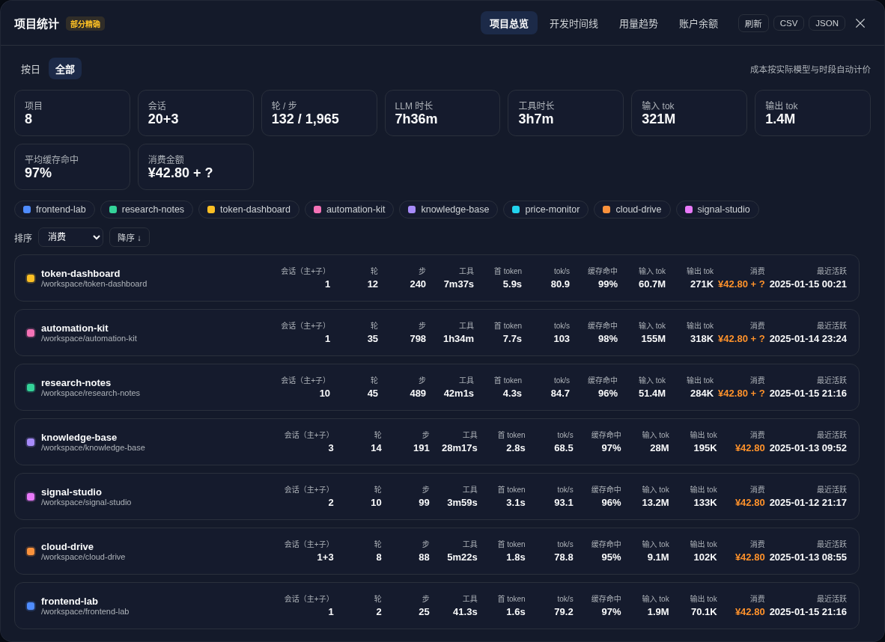
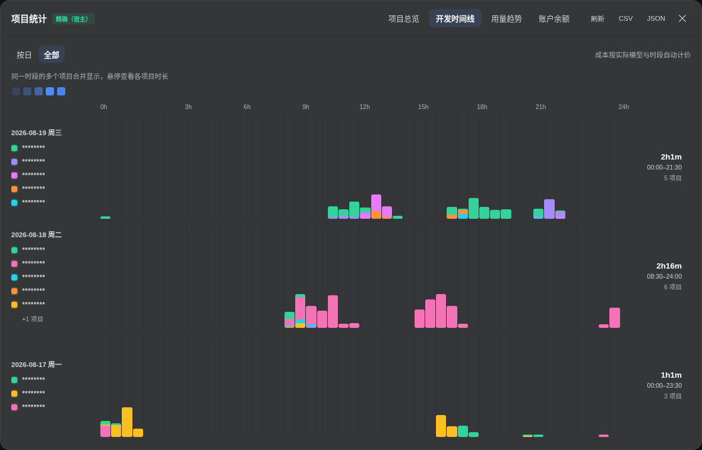
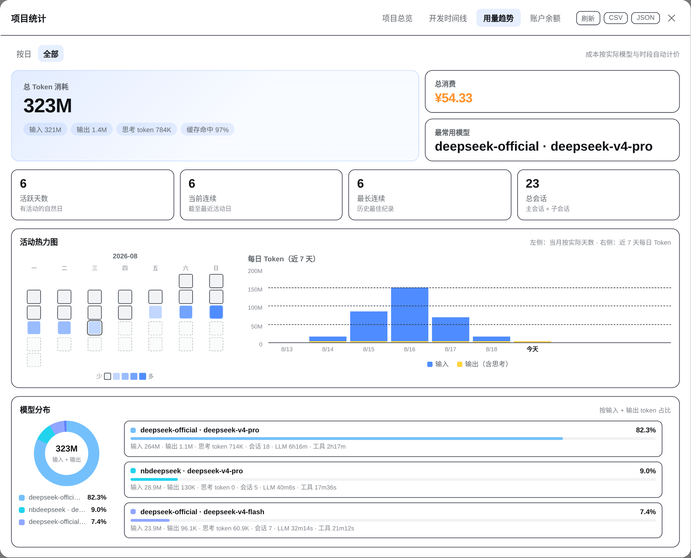
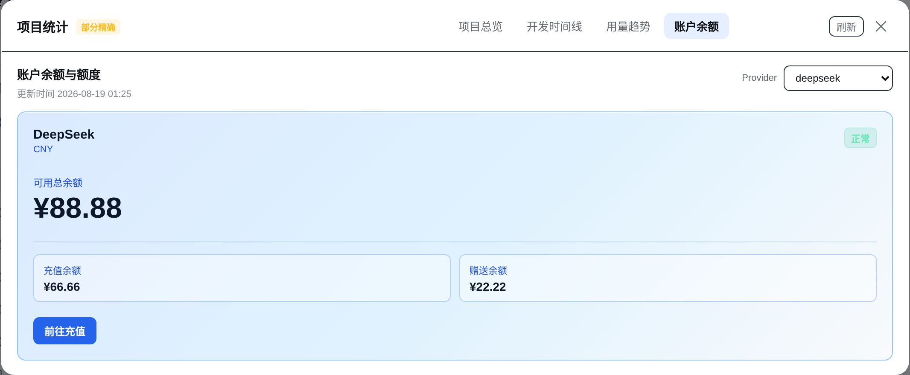

# @rongyi7/dsh-stats

English | [简体中文](README.md)

[](https://www.npmjs.com/package/@rongyi7/dsh-stats)
[](https://www.npmjs.com/package/@rongyi7/dsh-stats)
[](https://nodejs.org)
[](https://github.com/rongyishuaige7/dsh-stats/actions/workflows/ci.yml)
[](https://github.com/rongyishuaige7/dsh-stats/blob/main/LICENSE)

> Turn scattered DSH sessions into a dashboard you can understand at a glance: tokens, development time, model mix, spend, balances, and quotas in one sidebar panel. `(｡•̀ᴗ-)✧`

`@rongyi7/dsh-stats` is a [DeepSeek Harness](https://github.com/deepseek-ai/deepseek-harness) Web plugin. It uses host-side aggregation when available and falls back to a client-side approximation on older hosts, so the same UI remains useful during upgrades.

<p align="center">
  
</p>

> **Privacy note:** project names are rendered as `********`, paths as `/workspace/********`, and session identifiers are replaced before capture. Balance amounts use demo values; aggregate dates, tokens, durations, and spend reflect the all-time view at capture. No API key, cookie, management token, raw session content, or upstream response appears in these images. The plugin also never sends those credentials or raw upstream responses to the browser.

## ✨ At a glance

| | Capability | What it gives you |
| --- | --- | --- |
| 📊 | Project overview | Per-project sessions, turns, tokens, cache hit rate, speed, and spend; inactive zero-usage projects stay out of the list. |
| ⏱️ | Development timeline | Event-based 30-minute activity slots, with colors and durations that remain readable when projects overlap. |
| 📈 | Usage trends | Seven-day input/output tokens, activity heatmap, model distribution, and per-model spend on hover. |
| 💳 | Provider-scoped pricing | Selects a rule from the real `provider + model + account type + time slot`; there is no manual model picker. |
| 👤 | Balances and quotas | DeepSeek, OpenRouter, Moonshot, and Z.ai API balances plus Kimi, Z.ai, and MiniMax Coding Plan windows. |
| 🔒 | Host-side credential boundary | Account requests run in the DSH host; the browser receives normalized balances and statuses only. |

The overview keeps up to seven project cards fully visible. The timeline keeps the most recent three days visible. Additional content scrolls inside the panel, so the surrounding layout stays stable. `(ง •̀_•́)ง`

## 🚀 Install in 30 seconds

### Requirements

- A DeepSeek Harness `web` profile.
- Node.js `>= 22`.

### Install from npm

```bash
dsh plugin --profile web add @rongyi7/dsh-stats
```

Restart the running DSH Web process:

```bash
dsh web
```

The “Stats” entry will appear at the bottom of the sidebar. Pin a release when you need a reproducible install:

```bash
dsh plugin --profile web add @rongyi7/dsh-stats@0.2.23
```

### Install a local tarball

```bash
dsh plugin --profile web add ./rongyi7-dsh-stats-0.2.23.tgz
```

Verify the bundle registration:

```bash
dsh --profile web --dump-config
```

You should see the `stats` entry and `@rongyi7/dsh-stats` in the bundle list. **Do not** use `npm install --prefix ~/.dsh/profiles/web ...` to mutate a DSH profile: profiles are managed by pnpm, and the official `dsh plugin` command keeps the dependency graph and bundle registration intact.

## 🖼️ Interface tour

These light-mode captures come from the running panel. Project identity fields are masked, balance amounts are examples, and the overview and trends show the all-time aggregate selected at capture:

<table>
  <tr>
    <td align="center"><strong>Project overview</strong><br></td>
    <td align="center"><strong>Development timeline</strong><br></td>
  </tr>
  <tr>
    <td align="center"><strong>Usage trends</strong><br></td>
    <td align="center"><strong>Account balance</strong><br></td>
  </tr>
</table>

### What is on each screen?

1. **Project overview** — summary cards for projects, sessions, tokens, LLM/tool time, and spend; sortable project rows expand into session details.
2. **Development timeline** — one row per day, with project colors and activity blocks; overlapping work remains distinguishable.
3. **Usage trends** — input and output use separate colors. Small output values keep a visible minimum bar, and hover reveals the exact value.
4. **Model distribution** — the donut and model list use a stable layout; hovering a model shows its tokens, share, and spend.
5. **Account balance** — DeepSeek uses a blue gradient card with available, topped-up, gifted, and recharge actions.

CSV and JSON exports are available on the statistical views. The balance view intentionally keeps refresh and close actions only: it is a cached account snapshot, not a historical ledger.

## 💰 Pricing

All rates are calculated per million tokens. Currencies are reported separately (for example `¥... + $...`) with no implicit FX conversion. The pricing engine considers context length, service tier, cache type, and effective time, and includes rule metadata in project exports for auditing.

| Provider | Built-in models | Pricing notes |
| --- | --- | --- |
| [DeepSeek](https://api-docs.deepseek.com/zh-cn/quick_start/pricing) | `deepseek-v4-pro`, `deepseek-v4-flash` | CNY; Beijing-time 30-minute slots select historical, peak, or off-peak rates. |
| [MiniMax](https://platform.minimaxi.com/docs/guides/pricing-paygo) | `MiniMax-M3`, `MiniMax-M2.7`, `MiniMax-M2.7-highspeed` | CNY; M3 separates standard/priority and `<=512K`/`>512K` context. |
| [OpenAI](https://developers.openai.com/api/docs/pricing) | `gpt-5.6-sol`, `gpt-5.6-terra`, `gpt-5.6-luna`, `gpt-5.6-cyber` | USD; includes the `272K` context tier. |
| [Anthropic](https://docs.anthropic.com/en/docs/about-claude/pricing) | Claude Opus 5, Sonnet 5, Sonnet 4.6, Haiku 4.5 | USD; cache-write duration gaps are explicitly estimated. |
| [Google](https://ai.google.dev/gemini-api/docs/pricing) | Gemini 3.7 Flash, 3.1 Pro Preview, 2.5 Pro/Flash | USD; includes the `200K` context tier; missing cache-storage duration is estimated. |
| [Moonshot/Kimi](https://platform.kimi.com/docs/pricing/chat.md) | Kimi K3, K2.7 Code/Highspeed, K2.6 | CNY; official model rules. |
| [Z.ai](https://docs.z.ai/guides/overview/pricing) | GLM 5.2, 5.1, 5, 5 Turbo, 4.7, 4.7 FlashX/Flash | USD; official model rules. |
| [OpenRouter](https://openrouter.ai/api/v1/models) | Dated routes for mainstream OpenAI, Anthropic, Google, Kimi, and GLM models | USD; catalog snapshots are marked `estimated`. |

Pricing is **provider-scoped**. A first-party list price is applied only when the provider is explicitly recognized as that official family. The DSH pass-through routes `nbdeepseek` and `deepseek-modlens` explicitly inherit DeepSeek's official API pricing; other relays, `local`, unknown providers, look-alike model names, and subscription/token-plan usage are never presented as API spend.

### Cost status guide

| Status | Meaning |
| --- | --- |
| `exact` | Every priced usage row matched a deterministic built-in rule. |
| `estimated` | An amount is available, but a dynamic snapshot or missing price-affecting metadata is involved. |
| `free` | All matched usage is free; the summary keeps a zero amount instead of displaying an unknown cost. |
| `partial` | Known and unpriced usage coexist; known totals remain visible with `+ ?`. |
| `unsupported` | No safe rule applies, so the amount is shown as `—` rather than guessed. |

Individual usage rows may also be marked `subscription` or `ambiguous`. Subscription aliases such as `coding-plan` and `coding_plan` are normalized before pricing and are never presented as API spend.

## 👤 Balances and subscription quotas

Account queries run only in the host. The references below are variable names, never secret values to paste into a README or chat:

| Account | Official endpoint | Default credential reference |
| --- | --- | --- |
| DeepSeek balance | `/user/balance` | `DEEPSEEK_API_KEY` |
| OpenRouter credits | `/api/v1/credits` | `OPENROUTER_MANAGEMENT_KEY` (Management Key required) |
| Moonshot balance | `/v1/users/me/balance` | `MOONSHOT_API_KEY` |
| Z.ai balance | `/api/paas/v4/balance` | `ZAI_API_KEY` |
| Kimi For Coding | `/coding/v1/usages` | `KIMI_API_KEY` |
| Z.ai Coding Plan | `/api/monitor/usage/quota/limit` | `ZAI_API_KEY` |
| MiniMax Coding Plan | [`/v1/token_plan/remains`](https://platform.minimaxi.com/subscribe/token-plan?tab=api-enterprise) plus official compatibility paths | `MINIMAX_API_KEY` |

`accountApiKeyEnv` can override a provider's account credential reference. Results are cached for five minutes and concurrent requests are deduplicated; the refresh button explicitly bypasses that cache. A transient network, rate-limit, or response error keeps the last successful snapshot and marks it stale. MiniMax configurations without an account type keep the historical Coding Plan default, while an explicit `accountType: api` is not queried as a subscription. Providers without a public account endpoint still contribute token usage and simply show “unsupported” on the balance screen.

## 🔐 Credential and privacy boundary

- Credentials are resolved through the DSH host `credentials` service only; they never enter the client bundle, RPC logs, or CSV/JSON exports.
- Account adapters allow fixed official HTTPS hosts, issue GET requests only, reject redirects, time out after 15 seconds, and cap responses at 1 MiB.
- Never commit real API keys, cookies, management keys, `auth.json`, or `.credentials.yaml` to Git, an issue, or an Agent conversation.
- The screenshots use `********` project labels, `/workspace/********` paths, and replaced session identifiers. Balance amounts are demo values; only aggregate dates and usage metrics from the selected all-time view remain.

## 🎯 Accuracy and data sources

The panel labels its current data source instead of silently implying precision:

- **Host exact** — the host RPC reads durable session logs and projections; the timeline uses event timestamps and 30-minute slots.
- **Partial/stale** — a log is missing, being written, or an account endpoint failed; known values remain visible with a warning.
- **Client approximate** — an older host does not expose the RPC, so the browser estimates from projection values. Useful for a quick glance, not an audit.

Dates, timeline slots, and DeepSeek peak/off-peak windows use explicit Beijing time (UTC+8), independent of the host machine timezone.

## ❓ FAQ

<details>
<summary><strong>Why does the panel say “Client approximate”?</strong></summary>

Tier 2 RPC did not load, or the host is still running an older plugin. Restart `dsh web` and confirm `stats` appears in `dsh --profile web --dump-config`. The source tooltip includes the concrete fallback error.
</details>

<details>
<summary><strong>Why is the most-used model `(unknown)`?</strong></summary>

The source session may not contain provider/model metadata, or that provider is not in the safe pricing catalog yet. The plugin refuses to map a similar-looking name to a first-party price; an explicit unknown is safer than a fabricated bill.
</details>

<details>
<summary><strong>Why does total spend end with `+ ?`?</strong></summary>

Known model rows were priced, but some tokens came from an unknown provider, a relay, or a subscription plan. Project CSV exports preserve `costStatus`, `ruleId`, `pricingSource`, provider, and model identity so the missing part can be audited.
</details>

<details>
<summary><strong>Why does the balance tab have no CSV/JSON buttons?</strong></summary>

CSV/JSON are historical statistics exports and remain on the overview, timeline, and trends views. The balance tab is a cached account snapshot, so it keeps refresh and close actions only.
</details>

<details>
<summary><strong>Why is the output bar much smaller than the input bar?</strong></summary>

Code sessions often send a much larger context than they generate. Output bars retain a minimum visible height, and hovering reveals the exact value. The “Output (incl. reasoning)” legend is centered below the seven-day chart.
</details>

<details>
<summary><strong>Why is the Stats entry missing after installation?</strong></summary>

DSH caches client modules and Typert descriptors. Confirm the install completed, fully restart `dsh web`, and hard-refresh the browser if necessary.
</details>

## 🧩 Tier 2 data flow (contributors)

<details>
<summary><strong>Show the architecture</strong></summary>

```text
browser client.cjs
  apply()
    -> ctx.remote.$mount(inlined STATS_REMOTE_CONTRIBUTION)
    -> ctx.inject(["remote", "remote.stats"], childCtx)
    -> childCtx.remote.stats.aggregate()
    -> childCtx.remote.stats.account()

host index.js
  StatsService
    aggregate(): workspace + projection + session.jsonl.zstd
               -> project totals, 30-minute timeline, model/pricing detail
    account(): balance and quota adapters with normalized stale fallback
    providers(): capability metadata only; credential values are never returned
    current(): legacy DeepSeek balance compatibility RPC
```

See [DESIGN.md](DESIGN.md) for the full contract, integration decisions, and hard-won Typert details. `lib/` is generated output: edit `src/`, then rebuild.
</details>

## 🛠️ Local development

```bash
npm install
npm run build
npm test
npm pack --dry-run
```

```text
src/index.js                # host StatsService and aggregate/account RPC
src/client.cjs              # client entry, React UI, and fallback
src/pricing.cjs             # provider-scoped, effective-dated pricing
src/accounts.js             # official balance/quota adapters (host only)
src/typert-host.js          # host Typert manifest and zod schema
src/typert-remote-client.js # client RPC descriptor
scripts/build.mjs           # esbuild build script
lib/                        # generated files shipped in the package
```

`prepublishOnly` rebuilds automatically before `npm publish`. For profile installation and iteration, always use the official `dsh plugin` command.

Release checklist:

```bash
npm run build
npm test
npm pack --dry-run
npm publish
```

## ⚠️ Known limitations

- The current session projection cache can lag by a few seconds; the panel refreshes every 60 seconds.
- The first request over many sessions may decode logs on the host; mtime caching reduces repeat work.
- Archived sessions remain in statistics and are marked archived.
- OpenRouter uses a dated model-catalog snapshot, so those amounts are `estimated`.
- Currencies are not converted. Unknown models, relays, local providers, and subscription usage are not guessed.
- Overlapping sessions in one project merge into wall-clock timeline intervals; project LLM/tool durations remain cumulative work metrics.

## 🙌 Contributing and license

Issues and pull requests are welcome. Licensed under the [MIT License](LICENSE).

`╰(*°▽°*)╯` May every stats panel make your development rhythm a little easier to see.
