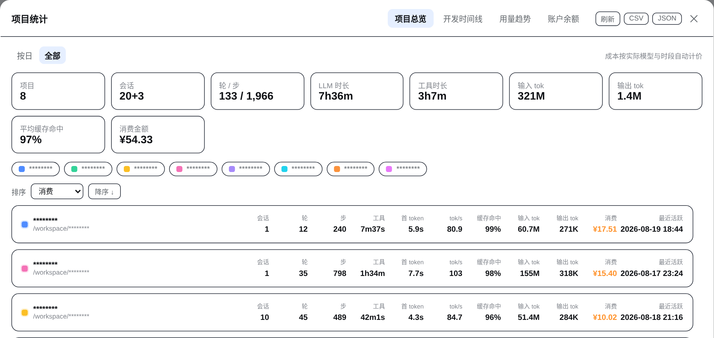
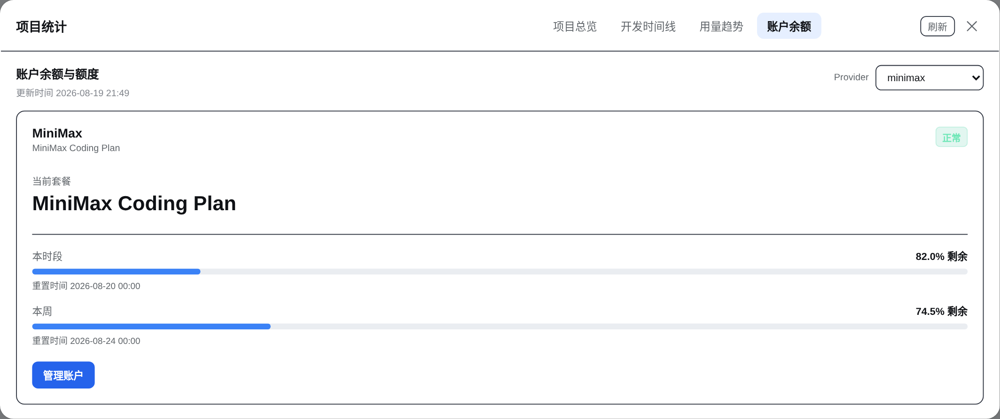

<h1 align="center">DSH Usage</h1>

<p align="center"><strong>See your DSH usage, time, and spend at a glance.</strong></p>
<p align="center">Organize sessions by project and see tokens, development time, model cost, and account balances.</p>

<p align="center">
  <a href="README.md">简体中文</a> · <strong>English</strong>
</p>

<p align="center">
  <a href="https://www.npmjs.com/package/@rongyi7/dsh-stats"></a>
  <a href="https://github.com/rongyishuaige7/dsh-stats/actions/workflows/ci.yml"></a>
  <a href="https://github.com/rongyishuaige7/dsh-stats/blob/main/LICENSE"></a>
</p>

> **DSH records every conversation. DSH Usage shows what each project used.** `(｡•̀ᴗ-)✧`

`DSH Usage` is a local [DeepSeek Harness](https://github.com/deepseek-ai/deepseek-harness) Web usage panel. It organizes DSH sessions by project, date, and model; when a price cannot be confirmed, it marks the amount instead of guessing.

<p align="center"><strong>Usage by project</strong> · <strong>Model-based cost</strong> · <strong>Keys stay local</strong> · <strong>One-click export</strong></p>

<p align="center">
  <a href="docs/images/overview.png"></a>
  <br>
  <sub>Light mode · masked project identity · click for the complete project overview</sub>
</p>

> Screenshots contain no API keys, cookies, management tokens, or session content. Project identities are masked, and balances and quotas use demo values. Costs are derived from public API pricing rules; the provider's bill remains authoritative.

## 🚀 Quick start

Requires a DeepSeek Harness `web` profile and Node.js `>= 22`.

```bash
dsh plugin --profile web add @rongyi7/dsh-stats
```

After installation, fully restart the running DSH Web process:

```bash
dsh web
```

Reopen the page. The “Usage” entry will appear at the bottom of the sidebar.

> **Name note:** The user-facing brand is now **DSH Usage**. To keep existing DSH profiles and remote interfaces working, the install package remains `@rongyi7/dsh-stats` for now; the install command does not change.

<details>
<summary><strong>Pin a version, install a tarball, or verify registration</strong></summary>

Pin a release:

```bash
dsh plugin --profile web add @rongyi7/dsh-stats@0.2.42
```

Install a local tarball:

```bash
dsh plugin --profile web add ./rongyi7-dsh-stats-0.2.42.tgz
```

Verify the bundle registration:

```bash
dsh --profile web --dump-config
```

You should see the `stats` entry and `@rongyi7/dsh-stats` in the bundle list. **Do not** use `npm install --prefix ~/.dsh/profiles/web ...` to mutate a DSH profile: profiles are managed by pnpm, and the official `dsh plugin` command keeps the dependency graph and bundle registration intact.
</details>

## ✨ Core capabilities

| Capability | What you get |
| --- | --- |
| 📊 Usage by project | Tokens, time, and spend for every project. |
| ⏱️ Development time | A simple day-by-day timeline with one block per 30 minutes. |
| 📈 Trends and models | Seven-day changes plus the models and projects you use most. |
| 💳 Cost estimates | Public model prices converted to RMB; unknown amounts are never guessed. |
| 👤 Balances and quotas | Balances and plan quotas for configured providers. |
| 🔒 Privacy and export | Keys stay on the host, and statistics export to CSV/JSON. |

The overview keeps up to seven projects visible, the timeline keeps the latest three days visible, and model distribution keeps three models visible. Additional content scrolls inside its own region, so the panel itself does not keep growing. `(ง •̀_•́)ง`

## 🖼️ Interface tour

These are light-mode captures of the running UI. Dense views use the full README width; click any image to inspect it at its original resolution.

### Project overview

Summary cards cover projects, sessions, tokens, LLM/tool time, and spend. Project rows support sorting, filtering, and expandable session details.

<p align="center">
  <a href="docs/images/overview.png"></a>
</p>

### Development timeline

Each row is one day and each color is one project. Overlapping activity shares the same time slot, while hover reveals each project's duration.

<p align="center">
  <a href="docs/images/timeline.png"></a>
</p>

### Usage trends

Input and output use separate colors. The activity heatmap is date-selectable, while model distribution combines tokens, share, and cost.

<p align="center">
  <a href="docs/images/trends.png"></a>
</p>

### Balances and quotas

DeepSeek shows available, topped-up, and gifted balances. MiniMax shows the current-window and weekly Coding Plan quotas. The account view keeps refresh and close actions only because account data is a current snapshot, not historical export data.

<table>
  <tr>
    <td width="50%" align="center"><strong>DeepSeek</strong><br><a href="docs/images/balance.png"></a></td>
    <td width="50%" align="center"><strong>MiniMax Coding Plan</strong><br><a href="docs/images/balance-minimax.png"></a></td>
  </tr>
</table>

Project overview, development timeline, and usage trends support CSV and JSON exports.

## 💰 Pricing

All rates are calculated per million tokens. Provider rules may be denominated in USD, but spend summaries are converted to RMB (CNY), and the UI and spend exports show RMB only. The current fixed FX snapshot is `1 USD = 6.7205 CNY`, retrieved on `2026-08-26` from [Frankfurter](https://api.frankfurter.app/2026-08-26?from=USD&to=CNY). The pricing engine considers context length, service tier, cache type, and effective time, and includes rule metadata and estimate status in project exports for auditing. Account balances remain in each provider's native currency.

| Provider | Built-in models | Pricing notes |
| --- | --- | --- |
| [DeepSeek](https://api-docs.deepseek.com/zh-cn/quick_start/pricing) | `deepseek-v4-pro`, `deepseek-v4-flash` | CNY; Beijing-time 30-minute slots select historical, peak, or off-peak rates. |
| [MiniMax](https://platform.minimaxi.com/docs/guides/pricing-paygo) | `MiniMax-M3`, `MiniMax-M2.7`, `MiniMax-M2.7-highspeed` | CNY; M3 separates standard/priority and `<=512K`/`>512K` context. |
| [OpenAI](https://developers.openai.com/api/docs/pricing) | `gpt-5.6-sol`, `gpt-5.6-terra`, `gpt-5.6-luna`, `gpt-5.6-cyber`, `gpt-5.4`, `gpt-5.4-mini` | Source rates are USD; uses the official standard rates retrieved on 2026-08-26, including the `272K` context tier; cache-write pricing for `gpt-5.4` models uses a conservative input-rate estimate when needed. |
| [Anthropic](https://docs.anthropic.com/en/docs/about-claude/pricing) | Claude Opus 5, Sonnet 5, Sonnet 4.6, Haiku 4.5 | USD; cache-write duration gaps are explicitly estimated. |
| [Google](https://ai.google.dev/gemini-api/docs/pricing) | Gemini 3.7 Flash, 3.1 Pro Preview, 2.5 Pro/Flash | USD; includes the `200K` context tier; missing cache-storage duration is estimated. |
| [Moonshot/Kimi](https://platform.kimi.com/docs/pricing/chat.md) | Kimi K3, K2.7 Code/Highspeed, K2.6 | CNY; official model rules. |
| [Z.ai](https://docs.z.ai/guides/overview/pricing) | GLM 5.2, 5.1, 5, 5 Turbo, 4.7, 4.7 FlashX/Flash | USD; official model rules. |
| [OpenRouter](https://openrouter.ai/api/v1/models) | Dated routes for mainstream OpenAI, Anthropic, Google, Kimi, and GLM models | USD; catalog snapshots are marked `estimated`. |

Pricing is primarily **provider-scoped**. Explicitly recognized first-party providers use their list prices and are `exact`; the DSH pass-through routes `nbdeepseek` and `deepseek-modlens` explicitly inherit DeepSeek's official API pricing. When an unknown or API-compatible provider has no usable pricing metadata but its model uniquely matches one first-party rule, the original provider is retained, the amount is marked `estimated`, and the result is converted to RMB. This is a public-price estimate, not the relay's bill. The estimate status remains available in data and exports, while the UI shows the calculated RMB amount without an approximation marker. Explicit `relay`/`local` modes, subscription/token-plan usage, unknown models, and ambiguous matches are not guessed, are excluded from the primary spend total, and retain an explanation in session details and warnings.

### Cost status guide

| Status | Meaning |
| --- | --- |
| `exact` | Every priced usage row matched a deterministic built-in rule. |
| `estimated` | An amount is available, but a dynamic snapshot, missing price-affecting metadata, or a unique official-model fallback for an unknown API provider is involved; the UI shows the calculated RMB amount, while the estimate status remains in data and exports. |
| `free` | All matched usage is free; the summary keeps a zero amount instead of displaying an unknown cost. |
| `partial` | Known and unpriced usage coexist; the primary total shows only included RMB, with the incomplete reason in details. |
| `unsupported` | No safe rule applies; the session is excluded from the primary spend total and the detail view explains why. |

Individual usage rows may also be marked `subscription` or `ambiguous`. Subscription aliases such as `coding-plan` and `coding_plan` are normalized before pricing and are never presented as API spend.

## 👤 Balances and subscription quotas

Account queries run only in the host. The references below are variable names, never secret values to paste into a README or chat:

| Account | Official endpoint | Default credential reference |
| --- | --- | --- |
| DeepSeek balance | `/user/balance` | `DEEPSEEK_API_KEY` |
| OpenRouter credits | `/api/v1/credits` | `OPENROUTER_MANAGEMENT_KEY` (Management Key required) |
| Moonshot balance | `/v1/users/me/balance` | `MOONSHOT_API_KEY` |
| Z.ai balance | `/api/paas/v4/balance` | `ZAI_API_KEY` |
| Kimi For Coding | `/coding/v1/usages` | `KIMI_API_KEY` |
| Z.ai Coding Plan | `/api/monitor/usage/quota/limit` | `ZAI_API_KEY` |
| MiniMax Coding Plan | [`/v1/token_plan/remains`](https://platform.minimaxi.com/subscribe/token-plan?tab=api-enterprise) plus official compatibility paths | `MINIMAX_API_KEY` |

`accountApiKeyEnv` can override a provider's account credential reference. Results are cached for five minutes and concurrent requests are deduplicated; the refresh button explicitly bypasses that cache. A transient network, rate-limit, or response error keeps the last successful snapshot and marks it stale. MiniMax configurations without an account type keep the historical Coding Plan default, while an explicit `accountType: api` is not queried as a subscription. Providers without a public account endpoint still contribute token usage and simply show “unsupported” on the balance screen.

## 🔐 Credential and privacy boundary

- Credentials are resolved through the DSH host `credentials` service only; they never enter the client bundle, RPC logs, or CSV/JSON exports.
- Account adapters allow fixed official HTTPS hosts, issue GET requests only, reject redirects, time out after 15 seconds, and cap responses at 1 MiB.
- Never commit real API keys, cookies, management keys, `auth.json`, or `.credentials.yaml` to Git, an issue, or an Agent conversation.
- The screenshots use `********` project labels, `/workspace/********` paths, and replaced session identifiers. Balance amounts and MiniMax quota values are demo values; only aggregate dates and usage metrics from the selected all-time view remain.

## 🎯 Accuracy and data sources

The panel labels its current data source instead of silently implying precision:

- **Host exact** — the host RPC reads durable session logs and projections; the timeline uses event timestamps and 30-minute slots.
- **Partial/stale** — a log is missing, being written, or an account endpoint failed; known values remain visible with a warning.
- **Client approximate** — an older host does not expose the RPC, so the browser estimates from projection values. Useful for a quick glance, not an audit.

Dates, timeline slots, and DeepSeek peak/off-peak windows use explicit Beijing time (UTC+8), independent of the host machine timezone.

## ❓ FAQ

<details>
<summary><strong>Why does the panel say “Client approximate”?</strong></summary>

Tier 2 RPC did not load, or the host is still running an older plugin. Restart `dsh web` and confirm `stats` appears in `dsh --profile web --dump-config`. The source tooltip includes the concrete fallback error.
</details>

<details>
<summary><strong>Why is the most-used model `(unknown)`?</strong></summary>

The source session may not contain provider/model metadata. When the model field itself is missing, there is no reliable rule to select, so the UI uses `(unknown)`. If a model is present but the provider is unknown and the model uniquely matches a first-party rule, the model remains visible and its calculated RMB amount is shown while the data retains `estimated`; ambiguous or unknown models still stay unpriced.
</details>

<details>
<summary><strong>Why does a session have no cost?</strong></summary>

The primary spend total shows only amounts that can be confirmed and converted to RMB. Archived logless forks, unknown models, explicit relay/local routes, and subscription usage are not guessed and are excluded from that total; session details, warnings, and exports retain `costStatus`, `ruleId`, `pricingSource`, provider/model identity, and the exclusion reason.
</details>

<details>
<summary><strong>Why does the balance tab have no CSV/JSON buttons?</strong></summary>

CSV/JSON are historical statistics exports and remain on the overview, timeline, and trends views. The balance tab is a cached account snapshot, so it keeps refresh and close actions only.
</details>

<details>
<summary><strong>Why is the output bar much smaller than the input bar?</strong></summary>

Code sessions often send a much larger context than they generate. Output bars retain a minimum visible height, and hovering reveals the exact value. The “Output (incl. reasoning)” legend is centered below the seven-day chart.
</details>

<details>
<summary><strong>Why is the Usage entry missing after installation?</strong></summary>

DSH caches client modules and Typert descriptors. Confirm the install completed, fully restart `dsh web`, and hard-refresh the browser if necessary.
</details>

## 🧩 Tier 2 data flow (contributors)

<details>
<summary><strong>Show the architecture</strong></summary>

```text
browser client.cjs
  apply()
    -> ctx.remote.$mount(inlined STATS_REMOTE_CONTRIBUTION)
    -> ctx.inject(["remote", "remote.stats"], childCtx)
    -> childCtx.remote.stats.aggregate()
    -> childCtx.remote.stats.account()

host index.js
  StatsService
    aggregate(): workspace + projection + session.jsonl.zstd
               -> project totals, 30-minute timeline, model/pricing detail
    account(): balance and quota adapters with normalized stale fallback
    providers(): capability metadata only; credential values are never returned
    current(): legacy DeepSeek balance compatibility RPC
```

See [DESIGN.md](DESIGN.md) for the full contract, integration decisions, and hard-won Typert details. `lib/` is generated output: edit `src/`, then rebuild.
</details>

## 🛠️ Local development

```bash
npm install
npm run build
npm test
npm pack --dry-run
```

```text
src/index.js                # host StatsService and aggregate/account RPC
src/client.cjs              # client entry, React UI, and fallback
src/pricing.cjs             # provider-scoped, effective-dated pricing
src/accounts.js             # official balance/quota adapters (host only)
src/typert-host.js          # host Typert manifest and zod schema
src/typert-remote-client.js # client RPC descriptor
scripts/build.mjs           # esbuild build script
lib/                        # generated files shipped in the package
```

`prepublishOnly` rebuilds automatically before `npm publish`. For profile installation and iteration, always use the official `dsh plugin` command.

Release checklist:

```bash
npm run build
npm test
npm pack --dry-run
npm publish
```

## ⚠️ Known limitations

- The current session projection cache can lag by a few seconds; the panel refreshes every 60 seconds.
- The first request over many sessions prefers the official projection-cache watermark ladder; older hosts fall back to log decoding, with mtime caching for repeat work.
- Ordinary archived sessions are marked archived; archived, logless forks backed only by inherited cache values are excluded and reported in warnings.
- OpenRouter uses a dated model-catalog snapshot, so those amounts are `estimated`.
- Spend summaries use RMB throughout, with USD converted using the documented FX snapshot; historical values are not re-fetched from the network each time the panel opens. Unknown API providers receive an `estimated` amount only when the model uniquely matches an official rule; explicit relays/local providers, unknown or ambiguous models, and subscription usage remain unpriced.
- Overlapping sessions in one project merge into wall-clock timeline intervals; project LLM/tool durations remain cumulative work metrics.

## 🙌 Contributing and license

Issues and pull requests are welcome. Licensed under the [MIT License](LICENSE).

`╰(*°▽°*)╯` May every stats panel make your development rhythm a little easier to see.
